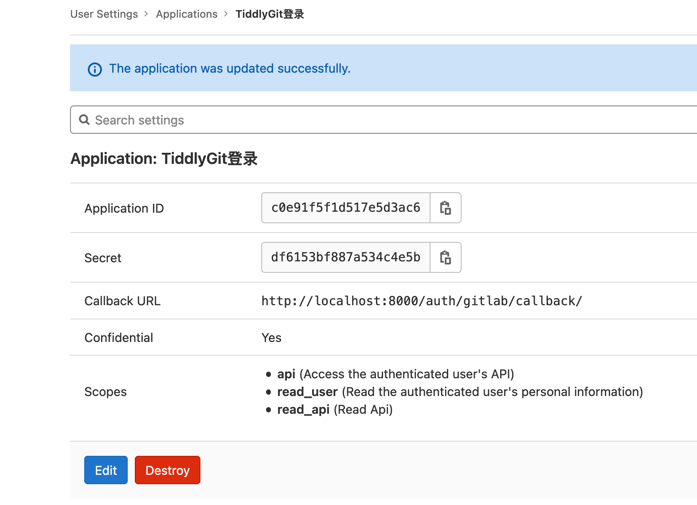

# Try run tiddlywiki editable instance behind an oAuth2

Use passportjs and its `passport-gitlab2` Strategy.

## Separate readonly TiddlyWiki and editable TiddlyWiki

The wiki in `template/wiki` is editable, and will be started by `src/wiki.js`, as a nodejs tiddlywiki, in-which all change will be sync to fs as standalone `.tid` files.

The wiki in `static/empty-wiki.html` is a readonly HTML tiddlywiki, and all changes won't be sync back to the fs.

We use Gitlab as a trusted identity provider in this example, it will provide our server with the username, and we compare username with local username in `.env` file, if they are the same, we allow user to see the editable wiki, otherwise, redirect to the readonly wiki.

You can bundle nodejs wiki to the readonly HTML wiki periodically, exclude private contents, and only bundle public content to the HTML wiki.

## Config Gitlab

Goto [https://gitlab.com/oauth/applications](https://gitlab.com/oauth/applications) fill in the form.



Callback URL should be `http://localhost:8000/auth/gitlab/callback/` instead of simply `http://localhost:8000/`, otherwise it will say `The redirect URI included is not valid`.

## Add local .env

Create a `.env` file in this folder, with content like:

```env
GITLAB_APP_ID=c0e91f...
GITLAB_APP_SECRET=df...
VALID_USER=linonetwo
```

Change these `GITLAB_APP_ID` and `GITLAB_APP_SECRET` to the one on your gitlab application just created.

And `VALID_USER` changed to your gitlab username. For example, my gitlab page is `https://gitlab.com/linonetwo`, so my user name is `linonetwo`.

## Start the server

```shell
npm start
```
